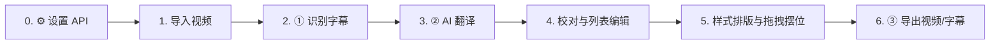
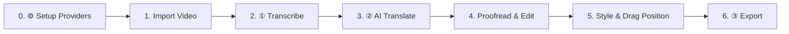

<div align="center">

# 🎬 K3 字幕生成器 (K3 Subtitle)

**新一代视频语音识别 · AI 多厂商智能翻译 · 双语可视化排版 · 画布拖动定位 · 无损/烧录导出**

[](https://www.python.org/)
[](https://nodejs.org/)
[](https://www.electronjs.org/)
[](https://react.dev/)
[](https://github.com/SYSTRAN/faster-whisper)
[-red)](https://github.com/ThaUnknown/jassub)
[]()

[📖 中文详细使用说明](#-中文详细使用说明) · [🌐 Comprehensive English Guide](#-comprehensive-english-guide)

</div>

---

## 📖 中文详细使用说明

### 📌 目录
- [✨ 核心亮点](#-核心亮点)
- [📦 安装与快速启动](#-安装与快速启动)
  - [方式一：下载发布安装包（推荐普通用户）](#方式一下载发布安装包推荐普通用户)
  - [方式二：Linux 环境运行](#方式二linux-环境运行)
  - [方式三：源码运行（开发者）](#方式三源码运行开发者)
- [🚀 全流程使用教程（从导入到导出）](#-全流程使用教程从导入到导出)
  - [步骤 0 · 基础配置（⚙ 设置）](#步骤-0--基础配置-设置)
  - [步骤 1 · 导入视频](#步骤-1--导入视频)
  - [步骤 2 · 语音识别生成字幕（①）](#步骤-2--语音识别生成字幕)
  - [步骤 3 · AI 智能翻译与双语生成（②）](#步骤-3--ai-智能翻译与双语生成)
  - [步骤 4 · 字幕列表校对与逐帧微调](#步骤-4--字幕列表校对与逐帧微调)
  - [步骤 5 · 样式排版与画布拖拽定位](#步骤-5--样式排版与画布拖拽定位)
  - [步骤 6 · 视频与字幕导出（③）](#步骤-6--视频与字幕导出)
- [🛠 编译与打包发布](#-编译与打包发布)
- [🏗 技术架构](#-技术架构)
- [❓ 常见问题与排错指南 (FAQ)](#-常见问题与排错指南-faq)

---

### ✨ 核心亮点

| 功能模块 | 核心优势与技术特性 |
|---|---|
| 🎙 **本地与云端双引擎 ASR** | 内置 [faster-whisper](https://github.com/SYSTRAN/faster-whisper)（CTranslate2 引擎），支持 NVIDIA GPU (CUDA 12) 极速硬件加速与自动语种探测，完全断网离线可用；同时兼容 OpenAI 云端 Whisper API。 |
| 🌐 **AI 大模型多厂商翻译** | 支持 OpenAI、DeepSeek、Kimi (Moonshot)、通义千问 (Qwen)、智谱 GLM、Claude / OpenRouter 及 DeepL（免费/付费）。采用多批次并发机制与段号对齐协议，**严格保证翻译段数与时间轴 100% 对齐**，遇解析异常自动降级逐条重试。 |
| 🈶 **双语/多轨同屏管理** | 自由切换源语言与多目标语言轨道；一键启用双语对照模式，主副语言**独立配置**字体、字号、颜色、描边、阴影与摆放位置，支持自由设定主语言置顶/置底。 |
| 👁 **真正的所见即所得 (WYSIWYG)** | 集成 WebAssembly 版 [jassub](https://github.com/ThaUnknown/jassub) (libass 渲染核心)，播放与暂停状态下实时响应样式变动，毫秒级即时呈现真实 ASS 渲染效果。 |
| 🖱 **视频画布自由拖拽定位** | 独创交互体验：**在视频画面上按住字幕即可自由拖拽**，实时更新中心点坐标；双语字幕下主副语言**各轨独立拖动**互不干扰，支持一键重置回标准九宫格对齐。 |
| ✏️ **专业级字幕时间轴编辑器** | 支持行内直接修改文本与时间码（`00:00:00.000` 格式）；点击字幕行视频自动跳转对齐试听，播放时当前句自动高亮并滚动跟随；提供悬停单段删除与一键全轨道清理空段落。 |
| 💾 **全能导出与烧录预览** | <li>**硬字幕内嵌烧录**：libx264 (CRF 18) 画面压制，自带**真实烧录预览帧**（与导出完全一致的渲染管线），兼容所有平台与播放器；</li><li>**软字幕 MKV 无损封装**：集成样式 ASS 轨与兼容 SRT 轨，视频流直接复制，**画质 0 损耗，秒级极速导出**；</li><li>**外挂字幕提取**：单轨或双语合并的 SRT / ASS 文件独立导出。</li> |

---

### 📦 安装与快速启动

#### 方式一：下载发布安装包（推荐普通用户）
前往 [Releases 页面](../../releases) 获取最新打包版本：
- **Windows**：下载 `K3-Subtitle-Setup-x.x.x.exe` 双击安装即可。安装包已完整内置 Python 独立后端与 ffmpeg 运行时，开箱即用，无需额外配置运行环境。

#### 方式二：Linux 环境运行
下载 `K3-Subtitle-x.x.x-x64-linux.tar.gz` 解压后，依赖系统 `python3` 与 `ffmpeg`：
```bash
# 1. 解压发布包
tar -xzf K3-Subtitle-x.x.x-x64-linux.tar.gz
cd K3-Subtitle-x.x.x-x64-linux

# 2. 安装系统与后端依赖 (Ubuntu/Debian 示例)
sudo apt update && sudo apt install -y ffmpeg python3 python3-pip
python3 -m pip install -r resources/backend/requirements.txt

# 3. 运行客户端
./k3-subtitle-app
```

#### 方式三：源码运行（开发者）
**环境要求**：
- Python 3.13+
- Node.js 20+
- （可选）NVIDIA 显卡驱动 + CUDA 12 运行环境（用于 GPU 加速识别）

```powershell
# 1. 克隆代码仓库
git clone https://github.com/gengsha/k3-zimugenerater.git
cd k3-zimugenerater

# 2. 创建并配置 Python 后端虚拟环境
python -m venv .venv
.\.venv\Scripts\python.exe -m pip install -r backend\requirements.txt

# 3. 安装前端依赖（若 Electron 下载缓慢可配置国内镜像源）
$env:ELECTRON_MIRROR = "https://npmmirror.com/mirrors/electron/"
cd app
npm install
cd ..

# 4. 启动开发模式（Electron 将自动拉起 Python FastAPI 后端子进程）
cd app
npm run dev
```
> 💡 **提示**：应用首次启动时会自动按需下载 ffmpeg 工具组件（约 80MB）及本地 Whisper 模型权重（如 turbo 模型约 1.6GB）。

---

### 🚀 全流程使用教程（从导入到导出）



#### 步骤 0 · 基础配置（⚙ 设置）
在主界面顶部点击「**⚙ 设置**」进入配置面板：
1. **AI 翻译厂商设置**：
   - 点击预设按钮（如 `+ DeepSeek`、`+ Kimi`、`+ 通义千问`、`+ OpenAI`、`+ OpenRouter`）或 `+ 空白厂商`。
   - 填写对应的 **Base URL**、**API Key** 与 **模型名称**（例如 `deepseek-chat`、`moonshot-v1-8k`、`gpt-4o-mini`、`qwen-plus`）。
   - 点击「**测试连接**」，后端将发送轻量级探测请求验证连通性与密钥有效性。
2. **DeepL 翻译设置**：
   - 若使用 DeepL，填入 API Key（免费版 Key 以 `:fx` 结尾，程序会自动路由至 DeepL Free 端点）。
3. **语音识别默认项**：
   - 可预设默认 Whisper 模型（如 `large-v3-turbo`）与设备偏好（`自动 / GPU / CPU`）。
> 🔒 **隐私说明**：所有 API Key 及配置仅保存在本地设备（`%LOCALAPPDATA%\K3Subtitle\config.json`），绝不上传任何第三方云端。

---

#### 步骤 1 · 导入视频
1. 点击顶部左侧的「**导入视频**」按钮；
2. 选择本地音视频文件，支持格式包括：`mp4`、`mkv`、`mov`、`avi`、`webm`、`ts`、`flv`、`wmv`、`m4v` 等；
3. 导入后播放器将加载视频画面，状态栏实时显示视频宽度、高度、总时长及音视频编码信息。

---

#### 步骤 2 · 语音识别生成字幕（①）
点击顶部流程栏的「**① 识别字幕**」打开识别对话框：

| 配置项 | 推荐选择 | 功能说明 |
|---|---|---|
| **识别引擎** | `本地 faster-whisper` | 默认推荐，离线运行、完全免费、无需网络与 API 额度消耗。也可选 `OpenAI 云端`。 |
| **模型规格** | `large-v3-turbo` | 识别速度与准确率平衡的最佳选择。可选 `large-v3`（最高精度）、`medium`、`small`、`base`、`tiny`（适合低配置机器）。首次使用时后台自动下载。 |
| **视频语言** | `自动检测` 或 指定语言 | 默认自动检测源语言。如已知视频为特定语言（如普通话、英语、日语等），手动指定可显著提升识别速度和首句准确率。 |

点击「**开始识别**」后，界面中央将出现任务进度覆盖层，实时显示识别百分比与耗时。完成后自动生成并激活源语言字幕轨（标记为 `SRC`）。

---

#### 步骤 3 · AI 智能翻译与双语生成（②）
点击顶部「**② 翻译**」打开翻译配置面板：
1. **源字幕轨**：选择用于翻译的基准轨道（默认选中当前的识别结果）；
2. **目标语言**：选择需要翻译成何种语言（支持简体中文、英语、日语、韩语、法语、德语、俄语、西班牙语、繁体中文等数十种语言）；
3. **翻译服务**：在下拉列表中选择在「⚙ 设置」中已配置好的 AI 大模型或 DeepL 服务；
4. 点击「**开始翻译**」，系统将对字幕分批并发请求，并使用格式校验机制**确保段落顺序与时间轴严格对应**。

翻译完成后将自动生成新的翻译字幕轨（标记为 `TRN`），并在轨道栏自动激活。

---

#### 步骤 4 · 字幕列表校对与逐帧微调
右侧的字幕列表面板支持实时互动校对：
- **修改文本与时间码**：点击文本域直接编辑；双击时间码可直接输入微调（格式：`00:00:01.250`），失焦或按回车即可生效；
- **精准跳转试听**：点击任意一条字幕卡片，视频播放器将瞬间跳转至该句的起始时间点（`start`），方便核对发音；
- **高亮实时跟随**：播放视频过程中，列表将实时高亮当前处于播发区间的字幕，并自动将视图滚动至可见区域；
- **单段删除**：将鼠标悬停在某条字幕行上，点击右侧出现的「✕」按钮即可单独删除该段；
- **一键清理空段**：若在编辑过程中将某些段落内容清空，轨道栏右侧将亮起红色的「**⚠ 清理空段 N**」按钮，点击可一键将所有轨道中的无文本空段同步剔除。

---

#### 步骤 5 · 样式排版与画布拖拽定位

##### 1. 轨道与双语切换
- 在轨道栏点击各语言页签，可分别切换当前正在编辑的语言；
- 当存在 2 条及以上轨道时，勾选「**双语对照 [BILINGUAL]**」，播放器即可同屏渲染双语字幕；
- 点击页签上的「**★ 主 / 设为主**」徽标，可指定该语言在双语渲染中作为主语言显示。

##### 2. 字体与视觉样式（针对当前选中轨道生效）
左下角的样式面板支持对各轨道进行深度定制：
- **字体名称**：自动读取本机 Windows 系统中已安装的字体库（如微软雅黑、思源黑体、霞鹜文楷、Arial 等）；
- **字号大小**：滑块或数字微调（8 ~ 200px）；
- **色彩与质感**：提供主文字颜色、文字描边颜色、描边粗细（0 ~ 10px）、阴影偏移深度（0 ~ 10px）、粗体与斜体开关。

##### 3. 画布交互拖拽摆位（特色功能）
- **拖拽操作**：在视频播放器画面上，**直接按住字幕并拖动鼠标**，字幕的中心点将精准跟随光标移动，释放鼠标即自动保存坐标（无论视频处于播放或暂停状态，均能毫秒级实时响应）；
- **双语分离拖拽**：双语模式下，两行字幕支持**完全独立拖动**。在轨道栏切换到目标语言页签后，拖动画面的操作仅作用于该语言，另一行语言位置保持不变；
- **坐标模式 vs 九宫格模式**：
  - 拖拽后自动切换为「**中心点绝对坐标模式**」（样式面板显示 `X 坐标` 与 `Y 坐标`，基于视频原始像素分辨率）；
  - 若需重置回居中对齐，点击面板中的「**↺ 恢复默认布局**」，即可切回标准的九宫格对齐（底部居中、左下、右上等）与边距控制模式。

---

#### 步骤 6 · 视频与字幕导出（③）
点击顶部「**③ 导出**」进入全功能导出对话框，支持多选组合输出：

```
┌────────────────────────────────────────────────────────────────────────┐
│ ③ 导出配置                                                             │
├────────────────────────────────────────────────────────────────────────┤
│ [√] SRT 字幕文件        [√] ASS 样式字幕文件        [√] 导出视频        │
│                                                                        │
│ 视频导出方式： ( ) 软字幕封装 (MKV)          (•) 内嵌字幕（烧录进画面） │
│ 烧录内容：     [ 自动（双语优先）          ▼ ]                         │
│                                                                        │
│ ┌────────────────────────────────────────────────────────────────────┐ │
│ │ 预览时间: [ 12.50 ] 秒   [ 取播放器当前画面 ]                      │ │
│ │ ┌────────────────────────────────────────────────────────────────┐ │ │
│ │ │                                                                │ │ │
│ │ │                      [ 真实烧录效果预览图 ]                    │ │ │
│ │ │                                                                │ │ │
│ │ └────────────────────────────────────────────────────────────────┘ │ │
│ └────────────────────────────────────────────────────────────────────┘ │
└────────────────────────────────────────────────────────────────────────┘
```

##### 三种导出模式对比：
1. **内嵌字幕（烧录进画面 - MP4）**：
   - **原理**：调用 ffmpeg + libass 滤镜将字幕像素级绘制并固化在视频画面上；
   - **画质参数**：采用 `libx264 -crf 18` 极高画质重新编码；
   - **特点**：**在任何设备、微信、剪映、B站、YouTube、小红书等平台均 100% 正常显示**，无播放器兼容性门槛；
   - **真实预览帧**：导出面板提供当前时间戳的真实烧录帧预览（与最终导出使用同一条 ffmpeg 管线），导出前即可确认效果。
2. **软字幕封装（无损快速 - MKV）**：
   - **原理**：将视频流、音频流与 ASS 样式字幕轨、SRT 兼容字幕轨打包进 MKV 容器；
   - **特点**：视频音频流直接复制（`stream copy`），**画质 0 损耗，数秒内瞬间导出完成**。在播放器中可随时切换或关闭字幕轨。
3. **独立字幕文件（SRT / ASS）**：
   - 支持将所有轨道分别保存为独立 `.srt` / `.ass` 文件，并在开启双语模式时额外生成一份双语合并字幕文件。

---

### 🛠 编译与打包发布

#### 1. 打包 Python 独立后端
```powershell
# 使用 PyInstaller 将后端打包为单文件 exe（--no-cuda 构建轻量 CPU 版）
.\.venv\Scripts\python.exe backend\build_exe.py --no-cuda
```
打包产物将输出至 `backend\dist\k3-backend.exe`。

#### 2. 构建桌面端安装包
```powershell
# Windows 安装包构建（生成至 release/ 目录下的 K3-Subtitle-Setup-x.x.x.exe）
cd app
npm run pack

# Linux 发布包构建（生成至 release/linux/ 目录下的 tar.gz 包）
npm run pack:linux
```

#### 3. 运行自动化测试
```powershell
# 后端 pytest 单元测试
.\.venv\Scripts\python.exe -m pytest backend\tests -v

# 前端 TypeScript 类型检查与 Vite 生产构建测试
cd app
npx tsc --noEmit
npx vite build
```

---

### 🏗 技术架构

```
┌───────────────────────────────────────────────────────────────────────────────┐
│                        Electron 桌面端宿主 (Main Process)                       │
│      - 随机动态空闲端口监听                                                    │
│      - 自动拉起与守护 Python FastAPI 后端子进程 (k3-backend.exe)                 │
│      - 原生文件选择与保存对话框 IPC 桥接                                       │
└───────────────────────────────────────┬───────────────────────────────────────┘
                                        │
                    ┌───────────────────┴───────────────────┐
                    ▼                                       ▼
┌───────────────────────────────────────┐ ┌───────────────────────────────────┐
│      前端渲染层 (Renderer Process)    │ │      后端服务层 (Python FastAPI)    │
│  - React 18 + TypeScript + Vite       │ │  - 本地 ASR (faster-whisper)      │
│  - Zustand 全局轨道与时间轴状态池      │ │  - 云端 ASR (OpenAI Whisper API)  │
│  - jassub (libass WebAssembly 引擎)   │ │  - AI 翻译器 (OpenAI/DeepSeek/etc)│
│  - 画布手势坐标转换与碰撞拖拽算法     │ │  - ASS / SRT 构建引擎             │
│  - 洛伦兹吸引子动态粒子待机画面       │ │  - ffmpeg 封装与硬字幕烧录        │
│  - WebSocket 任务进度广播监听         │ │  - 异步线程池与任务生命周期管理   │
└───────────────────────────────────────┘ └───────────────────────────────────┘
```

- **数据及配置存储路径**：`%LOCALAPPDATA%\K3Subtitle\config.json`（仅存本机）
- **日志诊断输出路径**：`%APPDATA%\k3-subtitle-app\backend.log`

---

### ❓ 常见问题与排错指南 (FAQ)

<details>
<summary><b>Q1: 导出的 MKV 软字幕视频在 Windows 自带播放器中看不到字幕？</b></summary>

> **解答**：Windows 10/11 自带的「电影和电视」或「Media Player」播放器对内嵌的 ASS 特效字幕轨兼容性有限（虽然文件内已附带兼容性 SRT 轨）。  
> **解决方案**：
> 1. 使用专业级媒体播放器（如 **VLC**、**PotPlayer**、**mpv**、**IINA**、**KMPlayer**）打开，即可完美呈现 ASS 字体与颜色样式；
> 2. 如需在手机、微信或社交媒体平台上直接播放，请在导出时选择「**内嵌字幕（烧录进画面）**」。
</details>

<details>
<summary><b>Q2: 本地识别提示没有使用 GPU 或报错 CUDA 缺失？</b></summary>

> **解答**：
> 1. faster-whisper 的 GPU 加速需要 NVIDIA 独立显卡，并要求安装支持 CUDA 12 的显卡驱动与 cuBLAS 运行库；
> 2. 若当前电脑无 NVIDIA 显卡（如使用 AMD 显卡或 Intel 核显），可在「⚙ 设置」中将识别设备指定为 `强制 CPU`，或在识别对话框选择 `small` / `base` 等轻量级模型。
</details>

<details>
<summary><b>Q3: 使用云端 Whisper 识别时提示 25MB 文件大小超限？</b></summary>

> **解答**：OpenAI 官方 Whisper API 对单次上传音频有 25MB 的硬性体积上限。虽然本程序在上传前会自动提取压缩版低码率音频流，但超过 1~2 小时的长视频依然可能超标。长视频强烈建议优先选择**本地 faster-whisper 引擎**识别。
</details>

<details>
<summary><b>Q4: 预览字幕出现方块乱码（豆腐块）？</b></summary>

> **解答**：
> 1. 这通常是由于选中的字体不支持该语言的字符集（例如某些英文字体无法显示中文字符）；
> 2. 尝试在左下角样式面板中切换为通用的中文字体（如 `Microsoft YaHei`、`SimHei`、`PingFang SC` 等）；
> 3. 若所有字体均显示异常，可重启应用以重新初始化系统字体映射表。
</details>

<details>
<summary><b>Q5: 拖动字幕定位后位置与视频画面有偏移？</b></summary>

> **解答**：本软件采用**视频原始像素坐标系**映射算法，已全面适配窗口缩放、黑边（Pillarbox / Letterbox）与高分屏 DPI 缩放。若发现偏离，可点击样式面板中的「↺ 恢复默认布局」重新对齐。
</details>

---

## 🌐 Comprehensive English Guide

<div align="center"><a href="#-中文详细使用说明">⬆ Back to Chinese Guide / 回到中文说明</a></div>

### 📌 Table of Contents
- [✨ Key Features](#-key-features)
- [📦 Installation & Getting Started](#-installation--getting-started)
  - [Method 1: Pre-built Releases (Recommended)](#method-1-pre-built-releases-recommended)
  - [Method 2: Linux Setup](#method-2-linux-setup)
  - [Method 3: From Source (Developers)](#method-3-from-source-developers)
- [🚀 Step-by-Step User Tutorial](#-step-by-step-user-tutorial)
  - [Step 0 · Initial Configuration (⚙ Settings)](#step-0--initial-configuration--settings)
  - [Step 1 · Import Video](#step-1--import-video)
  - [Step 2 · Speech Recognition (① Transcribe)](#step-2--speech-recognition--transcribe)
  - [Step 3 · AI Translation & Bilingual Subtitles (②)](#step-3--ai-translation--bilingual-subtitles-)
  - [Step 4 · Subtitle List Proofreading & Fine-Tuning](#step-4--subtitle-list-proofreading--fine-tuning)
  - [Step 5 · Styling & Canvas Drag Positioning](#step-5--styling--canvas-drag-positioning)
  - [Step 6 · Export Video & Subtitles (③)](#step-6--export-video--subtitles-)
- [🛠 Build & Packaging](#-build--packaging)
- [🏗 Architecture & Internals](#-architecture--internals)
- [❓ Frequently Asked Questions (FAQ)](#-frequently-asked-questions-faq)

---

### ✨ Key Features

| Module | Features & Technical Highlights |
|---|---|
| 🎙 **Local & Cloud ASR** | Embedded with [faster-whisper](https://github.com/SYSTRAN/faster-whisper) (CTranslate2), supporting NVIDIA GPU (CUDA 12) acceleration and automatic language detection with 100% offline capability; also supports OpenAI Whisper API. |
| 🌐 **Multi-Provider AI Translation** | Seamless integration with OpenAI, DeepSeek, Kimi (Moonshot), Qwen, Zhipu GLM, OpenRouter, and DeepL (Free/Pro). Batch concurrency protocol guarantees **exact 1:1 timeline & segment alignment**, with automatic per-line fallback upon parsing anomalies. |
| 🈶 **Bilingual & Multi-Track** | Freely switch between source and target language tracks; toggle bilingual stacked rendering with **independent styling** (font family, size, color, outline, shadow, position) for primary and secondary subtitles. |
| 👁 **True WYSIWYG Rendering** | Powered by [jassub](https://github.com/ThaUnknown/jassub) (libass WebAssembly), providing instant pixel-accurate subtitle rendering in real time during both playback and pause. |
| 🖱 **Canvas Drag Positioning** | **Click and drag subtitles directly on the video canvas** to adjust center-point positions. In bilingual mode, primary and secondary subtitles can be moved **independently**. |
| ✏️ **Pro Subtitle Editor** | In-place text and timecode editing (`00:00:00.000` format); click any row to jump and verify audio; active sentence highlighting with auto-scroll; one-click cleanup for empty segments. |
| 💾 **Versatile Export Pipeline** | <li>**Burned-in Subtitles**: High-quality libx264 (CRF 18) hard-sub encoding with **real-time preview frames** matching the exact export pipeline;</li><li>**Lossless MKV Multiplexing**: Stream copy packaging with styled ASS & fallback SRT tracks in seconds;</li><li>**Subtitle Files**: Standalone `.srt` / `.ass` files or merged bilingual files.</li> |

---

### 📦 Installation & Getting Started

#### Method 1: Pre-built Releases (Recommended)
Download the latest pre-packaged release from the [Releases page](../../releases):
- **Windows**: Download `K3-Subtitle-Setup-x.x.x.exe` and run the installer. The standalone Python backend and ffmpeg binaries are bundled out of the box.

#### Method 2: Linux Setup
Download `K3-Subtitle-x.x.x-x64-linux.tar.gz`, extract it, and install runtime dependencies:
```bash
# 1. Extract package
tar -xzf K3-Subtitle-x.x.x-x64-linux.tar.gz
cd K3-Subtitle-x.x.x-x64-linux

# 2. Install system & python dependencies (Ubuntu/Debian)
sudo apt update && sudo apt install -y ffmpeg python3 python3-pip
python3 -m pip install -r resources/backend/requirements.txt

# 3. Launch application
./k3-subtitle-app
```

#### Method 3: From Source (Developers)
**Prerequisites**:
- Python 3.13+
- Node.js 20+
- (Optional) NVIDIA GPU + CUDA 12 drivers for GPU ASR acceleration

```powershell
# 1. Clone the repository
git clone https://github.com/gengsha/k3-zimugenerater.git
cd k3-zimugenerater

# 2. Setup Python virtual environment
python -m venv .venv
.\.venv\Scripts\python.exe -m pip install -r backend\requirements.txt

# 3. Install frontend dependencies
$env:ELECTRON_MIRROR = "https://npmmirror.com/mirrors/electron/"
cd app
npm install
cd ..

# 4. Start in development mode
cd app
npm run dev
```
> 💡 **Note**: On the very first launch, ffmpeg binaries (~80MB) and the default Whisper model weights (e.g. `large-v3-turbo` ~1.6GB) will be downloaded automatically.

---

### 🚀 Step-by-Step User Tutorial



#### Step 0 · Initial Configuration (⚙ Settings)
Click **⚙ Settings** in the top navigation bar:
1. **AI Translation Providers**:
   - Click preset buttons (e.g. `+ DeepSeek`, `+ Kimi`, `+ Qwen`, `+ OpenAI`, `+ OpenRouter`) or `+ Blank Provider`.
   - Enter your **Base URL**, **API Key**, and **Model Name** (e.g., `deepseek-chat`, `gpt-4o-mini`, `moonshot-v1-8k`).
   - Click **Test Connection** to verify API key validity.
2. **DeepL Translation**:
   - Provide your DeepL API key (keys ending with `:fx` are automatically mapped to the DeepL Free endpoint).
3. **ASR Preferences**:
   - Select default Whisper model (`large-v3-turbo`) and hardware acceleration device (`Auto / CUDA / CPU`).
> 🔒 **Security Notice**: All API keys and local settings are stored exclusively on your local machine (`%LOCALAPPDATA%\K3Subtitle\config.json`).

---

#### Step 1 · Import Video
1. Click **Import Video** in the top left;
2. Select your video file. Supported formats: `mp4`, `mkv`, `mov`, `avi`, `webm`, `ts`, `flv`, `wmv`, `m4v`;
3. The video player loads immediately, displaying video resolution, duration, and stream codecs in the status bar.

---

#### Step 2 · Speech Recognition (① Transcribe)
Click **① Transcribe** to open the transcription dialog:

| Parameter | Recommended Choice | Description |
|---|---|---|
| **Engine** | `Local faster-whisper` | Offline, free, GPU accelerated, no API quota consumed. |
| **Model** | `large-v3-turbo` | Recommended balance between speed and transcription accuracy. Smaller models (`medium`, `small`, `base`, `tiny`) are also available for lower hardware specs. |
| **Language** | `Auto Detect` or Specific | Auto-detects spoken language. Specifying the exact language improves accuracy for accented speech or noisy audio. |

Click **Start Transcription**. A progress overlay will report real-time status and elapsed time. Upon completion, a source subtitle track (`SRC`) is created.

---

#### Step 3 · AI Translation & Bilingual Subtitles (②)
Click **② Translate** in the top bar:
1. **Source Track**: Choose the source track with transcribed segments;
2. **Target Language**: Select target language (English, Simplified/Traditional Chinese, Japanese, Korean, French, German, Spanish, Russian, etc.);
3. **Translation Service**: Select any configured AI provider or DeepL;
4. Click **Start Translation**. Batch processing guarantees strict timeline alignment with the source track.

A new translation track (`TRN`) will be created and activated automatically.

---

#### Step 4 · Subtitle List Proofreading & Fine-Tuning
The right-hand subtitle editor allows rapid review:
- **Edit Text & Timecodes**: Type directly in the text area or timecode inputs (format: `00:00:01.250`);
- **Seek on Click**: Click any subtitle row to jump the video to that exact timestamp;
- **Playback Highlight**: The active subtitle line highlights automatically and stays in view as the video plays;
- **Delete Segment**: Hover over a row and click the **✕** button to delete it;
- **Clean Empty Segments**: When empty lines remain, click the red **⚠ Clean empty rows N** button in the track bar to remove all blank entries across all tracks.

---

#### Step 5 · Styling & Canvas Drag Positioning

##### 1. Track & Bilingual Control
- Click track tabs to switch between languages;
- When multiple tracks exist, check **双语对照 [BILINGUAL]** to render both languages simultaneously;
- Click the **★ Primary / Set Primary** badge on any tab to determine which language appears as the primary line.

##### 2. Font & Visual Styles
In the lower-left style panel, customize the active track:
- **Font Family**: Select from local system fonts (e.g. Arial, Segoe UI, Roboto, Microsoft YaHei, etc.);
- **Font Size**: Range from 8 to 200px;
- **Colors & Effects**: Primary fill color, outline color, outline width (0–10px), shadow depth (0–10px), bold, and italic toggles.

##### 3. Canvas Drag Positioning
- **Drag Interaction**: **Click and hold the subtitle on the video player**, then move your mouse. The center coordinate of the subtitle will track your cursor with real-time feedback;
- **Independent Bilingual Movement**: In bilingual mode, switch to the desired track tab and drag. Only the selected language moves while the other remains stationary;
- **Coordinate vs 9-Cell Grid**:
  - Dragging automatically switches the track to **Center-Point Coordinate Mode** (displaying exact `X` and `Y` pixel values);
  - Click **↺ Reset Layout** to revert back to standard 9-cell alignment (Bottom-Center, Top-Left, etc.) and margins.

---

#### Step 6 · Export Video & Subtitles (③)
Click **③ Export** to open the export configuration window:

```
┌────────────────────────────────────────────────────────────────────────┐
│ ③ Export Configuration                                                 │
├────────────────────────────────────────────────────────────────────────┤
│ [√] SRT Subtitle File    [√] ASS Styled Subtitles    [√] Export Video   │
│                                                                        │
│ Video Mode:    ( ) Lossless Mux (MKV)        (•) Burn-in Subtitles(MP4)│
│ Burn Track:    [ Auto (Bilingual Preferred)  ▼ ]                       │
│                                                                        │
│ ┌────────────────────────────────────────────────────────────────────┐ │
│ │ Preview Timestamp: [ 12.50 ] s   [ Capture Current Frame ]         │ │
│ │ ┌────────────────────────────────────────────────────────────────┐ │ │
│ │ │                                                                │ │ │
│ │ │                     [ Real Burn-in Preview ]                   │ │ │
│ │ │                                                                │ │ │
│ │ └────────────────────────────────────────────────────────────────┘ │ │
│ └────────────────────────────────────────────────────────────────────┘ │
└────────────────────────────────────────────────────────────────────────┘
```

##### Comparison of Export Modes:
1. **Burn-in Subtitles (Hardsub - MP4)**:
   - **Mechanism**: Burns subtitles directly onto the video frames using `ffmpeg + libass` filter at `libx264 -crf 18` quality;
   - **Advantage**: **100% visible on every device, player, and social media platform** (YouTube, TikTok, Instagram, Bilibili) without font or player dependency;
   - **Real Preview**: Inspect a sample frame rendered with the exact same ffmpeg pipeline before starting full export.
2. **Lossless Multiplexing (Softsub - MKV)**:
   - **Mechanism**: Muxes video, audio, ASS styled subtitles, and fallback SRT tracks into an MKV container without re-encoding;
   - **Advantage**: **Zero quality loss, completes in seconds**. Subtitle tracks can be toggled on/off in media players.
3. **Subtitle Files (SRT / ASS)**:
   - Exports separate `.srt` / `.ass` files per track, plus an optional merged bilingual subtitle file.

---

### 🛠 Build & Packaging

#### 1. Build Standalone Python Backend
```powershell
.\.venv\Scripts\python.exe backend\build_exe.py --no-cuda
```
Outputs the standalone executable to `backend\dist\k3-backend.exe`.

#### 2. Package Desktop Client
```powershell
# Windows NSIS Installer (outputs to release/ directory)
cd app
npm run pack

# Linux standalone package (outputs to release/linux/)
npm run pack:linux
```

#### 3. Run Automated Tests
```powershell
# Backend pytest suite
.\.venv\Scripts\python.exe -m pytest backend\tests -v

# Frontend TypeScript check and Vite production build
cd app
npx tsc --noEmit
npx vite build
```

---

### 🏗 Architecture & Internals

```
┌───────────────────────────────────────────────────────────────────────────────┐
│                        Electron Host (Main Process)                           │
│      - Dynamic local free port binding                                        │
│      - Child process management for Python backend (k3-backend.exe)           │
│      - Native file dialog IPC handlers                                        │
└───────────────────────────────────────┬───────────────────────────────────────┘
                                        │
                    ┌───────────────────┴───────────────────┐
                    ▼                                       ▼
┌───────────────────────────────────────┐ ┌───────────────────────────────────┐
│     Frontend UI (Renderer Process)    │ │    Backend Services (FastAPI)       │
│  - React 18 + TypeScript + Vite       │ │  - Local ASR (faster-whisper)       │
│  - Zustand track & timeline store     │ │  - Cloud ASR (OpenAI Whisper API)   │
│  - jassub (libass WebAssembly)        │ │  - Multi-Provider AI Translator     │
│  - Canvas coordinate transform engine │ │  - ASS / SRT format builders        │
│  - Interactive Lorenz attractor visual│ │  - ffmpeg multiplexer & hard-sub    │
│  - WebSocket task progress receiver   │ │  - Thread pool task manager         │
└───────────────────────────────────────┘ └───────────────────────────────────┘
```

- **Configuration Path**: `%LOCALAPPDATA%\K3Subtitle\config.json`
- **Backend Log File**: `%APPDATA%\k3-subtitle-app\backend.log`

---

### ❓ Frequently Asked Questions (FAQ)

<details>
<summary><b>Q1: Why are subtitles missing when playing the exported MKV in the default Windows player?</b></summary>

> **Answer**: The built-in Windows 10/11 Media Player has limited support for embedded ASS soft subtitle tracks.  
> **Solution**:
> 1. Play the file with media players supporting ASS subtitles such as **VLC**, **PotPlayer**, **mpv**, or **IINA**;
> 2. Or choose **Burn-in Subtitles (Hardsub)** during export for universal device compatibility.
</details>

<details>
<summary><b>Q2: GPU is not being utilized during local transcription?</b></summary>

> **Answer**:
> 1. GPU acceleration requires an NVIDIA graphics card with CUDA 12 supported drivers;
> 2. For systems without an NVIDIA GPU, set the device to `Force CPU` in Settings and select lightweight models like `small` or `base`.
</details>

<details>
<summary><b>Q3: Cloud transcription gives a 25MB file limit error?</b></summary>

> **Answer**: OpenAI's Whisper API imposes a 25MB file upload limit. While K3 automatically compresses audio before uploading, very long video files may exceed this threshold. Use **Local faster-whisper** for long videos.
</details>

<details>
<summary><b>Q4: Subtitles display as square "tofu" boxes?</b></summary>

> **Answer**:
> 1. The selected font might not contain glyphs for the active language;
> 2. Switch to a font with broad Unicode coverage (e.g. `Microsoft YaHei`, `Arial Unicode MS`, `Noto Sans`);
> 3. Restarting the application refreshes the system font mapping table.
</details>

---

<div align="center">

**License** · MIT License / 仅供学习与技术交流使用

</div>
